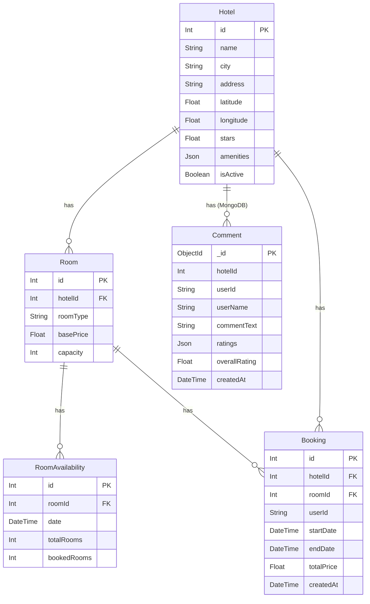

# LuminaHotels — SE4458 Final Project

Hotel booking system built with a microservices architecture, similar to Hotels.com.

---

## Live Demo & Video

| | Link |
|---|---|
| Frontend | https://hotel-booking-system-umber-seven.vercel.app/ |
| Demo Video | https://drive.google.com/drive/folders/1yFUOB4WoGQUjg7oeOOpvb302TpcWKHQp?usp=sharing |

## Deployed Services

### Application Services

| Service | Provider | URL |
|---|---|---|
| Frontend | Vercel | https://hotel-booking-system-umber-seven.vercel.app/ |
| API Gateway | Azure App Services | https://api-gateway-fthzgsdmc2dhfzd2.austriaeast-01.azurewebsites.net/api-docs |
| Hotel Service | Azure App Services | https://hotel-service-ewa3a5f8asd8d0fs.austriaeast-01.azurewebsites.net |
| Comments Service | Azure App Services | https://comments-service-ejgyh2gtd7hme5es.austriaeast-01.azurewebsites.net |
| AI Agent Service | Azure App Services | https://ai-agent-service-fmfgczbbhhdsh5du.austriaeast-01.azurewebsites.net |
| Notification Service | Azure App Services | https://notification-service-gwbyexhag9h4gvdf.austriaeast-01.azurewebsites.net |

### Infrastructure & Data Services

| Service | Provider | Description |
|---|---|---|
| PostgreSQL | Supabase | Managed PostgreSQL — transactional hotel/booking/room data |
| Auth (IAM) | Supabase Auth | JWT-based authentication, role stored in `app_metadata` |
| MongoDB | MongoDB Atlas | Managed NoSQL cluster — comments and ratings |
| Redis Cache | Upstash | Serverless Redis — hotel detail (1h TTL) and search cache (5min TTL) |
| Message Queue | CloudAMQP | Managed RabbitMQ — `new_reservations_queue` for async booking notifications |
| Scheduler | Azure Logic Apps | Nightly capacity check — triggers `POST /api/internal/check-capacity` |

## Scheduling — Azure Logic Apps

The nightly capacity check task is implemented using **Azure Logic Apps** (`HotelCapacityScheduler`).

- **Trigger:** Daily recurrence (every 24 hours)
- **Action:** `POST` to Notification Service `/api/internal/check-capacity`
- **Logic:** Queries all rooms with less than 20% availability for the next month and logs admin alerts
- **Definition file:** [`infrastructure/hotel-capacity-scheduler.json`](infrastructure/hotel-capacity-scheduler.json)

```
Azure Logic Apps (Daily)
        │
        ▼ POST /api/internal/check-capacity
Notification Service
        │
        ▼ SQL Query: bookedRooms/totalRooms > 0.80 for next month
PostgreSQL
        │
        ▼ [ALERT] logs per hotel
```

New reservation notifications are handled separately via **RabbitMQ** (event-driven, not scheduled):

```
User books hotel
        │
        ▼ publish → new_reservations_queue
Hotel Service (RabbitMQ)
        │
        ▼ consume (real-time)
Notification Service → logs reservation confirmation
```

---

## Architecture Overview

```
                        ┌─────────────────┐
                        │    Frontend     │
                        │  React / Vite   │
                        │   (port 5173)   │
                        └────────┬────────┘
                                 │ HTTP
                        ┌────────▼────────┐
                        │   API Gateway   │  JWT auth (Supabase)
                        │  Express/Node   │  /api/v1/* routes
                        │   (port 3000)   │
                        └──┬──┬──┬────────┘
                           │  │  │
           ┌───────────────┘  │  └──────────────┐
           │           ┌──────┘                 │
           ▼           ▼                        ▼
    ┌──────────┐ ┌──────────┐          ┌──────────────┐
    │  Hotel   │ │Comments  │          │  AI Agent    │
    │ Service  │ │ Service  │          │   Service    │
    │  :3001   │ │  :3002   │          │    :3003     │
    └──┬────┬──┘ └────┬─────┘          └──────┬───────┘
       │    │         │                       │
  ┌────▼─┐  │    ┌────▼───┐             ┌─────▼───┐
  │Postgr│  │    │MongoDB │             │  Groq   │
  │Redis │  │    └────────┘             │   LLM   │
  └──────┘  │                           └─────────┘
            │ publish (on booking)
            ▼
       ┌──────────┐     ┌──────────────────────┐
       │ RabbitMQ │     │   Azure Logic Apps   │
       │  Queue   │     │  (nightly scheduler) │
       └────┬─────┘     └──────────┬───────────┘
            │ consume              │ POST /check-capacity
            └──────────┬───────────┘
                       ▼
              ┌──────────────────┐
              │  Notification    │
              │    Service       │  → Resend (email)
              │   (internal)     │
              └──────────────────┘
```

---

## Tech Stack

| Layer | Technology |
|---|---|
| Frontend | React 18, Vite, Supabase JS |
| API Gateway | Node.js, Express, http-proxy-middleware |
| Hotel Service | Node.js, Express, Prisma ORM |
| Comments Service | Node.js, Express, Mongoose |
| AI Agent Service | Python, FastAPI, Groq (llama-3.1-8b-instant) |
| Notification Service | Node.js, Express, amqplib |
| Auth (IAM) | Supabase Auth (JWT) |
| Primary DB | PostgreSQL 15 |
| NoSQL DB | MongoDB 6 |
| Cache | Redis 7 via Upstash (Cache-Aside pattern) |
| Message Queue | RabbitMQ 3 via CloudAMQP |
| Containerization | Docker, Docker Compose |

---

## Getting Started

### Prerequisites
- Docker & Docker Compose
- Node.js 18+ (for local development)
- A Supabase project (for auth)
- A Groq API key (for AI agent)

### 1. Clone & Configure

```bash
git clone <repo-url>
cd SE4458_Final
```

Create `api-gateway/.env`:
```env
SUPABASE_URL=https://<your-project>.supabase.co
SUPABASE_ANON_KEY=<your-anon-key>
```

Create `services/ai-agent-service/.env`:
```env
GROQ_API_KEY=<your-groq-api-key>
```

Create `frontend/.env`:
```env
VITE_API_GATEWAY_URL=http://localhost:3000
VITE_SUPABASE_URL=https://<your-project>.supabase.co
VITE_SUPABASE_ANON_KEY=<your-anon-key>
```

### 2. Start all services

```bash
docker-compose up --build
```

This starts: PostgreSQL, MongoDB, Redis, RabbitMQ, API Gateway, Hotel Service, Comments Service, AI Agent Service, Notification Service.

### 3. Run DB migrations

```bash
docker exec hotel_core_service npx prisma migrate deploy
```

### 4. Start frontend (dev)

```bash
cd frontend
npm install
npm run dev
```

Frontend runs at `http://localhost:5173`.

### Setting a user as Admin

In Supabase Dashboard → Authentication → Users → select user → edit `app_metadata`:
```json
{ "role": "admin" }
```

---

## API Reference (v1)

All endpoints are prefixed with `/api/v1/`. The gateway strips `/v1` before forwarding to internal services.

### Hotel Service

| Method | Endpoint | Auth | Description |
|---|---|---|---|
| GET | `/api/v1/hotels/search` | Optional | Search hotels by city, dates, adults. Supports `?page=1&limit=10`. Logged-in users get 15% discount. |
| GET | `/api/v1/hotels/:id` | Public | Hotel detail (Redis cached, TTL 1h) |
| POST | `/api/v1/hotels/book` | Required | Create booking (Prisma transaction + RabbitMQ event) |
| GET | `/api/v1/admin/hotels` | Admin | List all hotels with rooms |
| POST | `/api/v1/admin/hotels` | Admin | Create new hotel with rooms |
| PATCH | `/api/v1/admin/hotels/:id` | Admin | Update hotel image URL |
| POST | `/api/v1/admin/rooms/:roomId/availability` | Admin | Set room availability for a date range (rejects if new totalRooms < existing bookedRooms) |

### Comments Service

| Method | Endpoint | Auth | Description |
|---|---|---|---|
| POST | `/api/v1/comments/add` | Required | Add comment with 5-category ratings (1–10) |
| GET | `/api/v1/comments/hotel/:hotelId` | Public | Get paginated comments + aggregated graph data. Supports `?page=1&limit=10`. |

### AI Agent Service

| Method | Endpoint | Auth | Description |
|---|---|---|---|
| POST | `/api/v1/agent/chat` | Optional | Chat with AI. Supports `search_hotels` and `book_hotel` tool calls. |

### Notification Service (Internal)

| Method | Endpoint | Description |
|---|---|---|
| POST | `/api/v1/notifications/api/internal/check-capacity` | Triggered by scheduler — alerts hotels with <20% room availability next month |

---

## Pagination

Endpoints that support pagination return:
```json
{
  "data": [...],
  "pagination": {
    "page": 1,
    "limit": 10,
    "total": 42,
    "totalPages": 5
  }
}
```

---

## ER Diagram



> `Hotel`, `Room`, `RoomAvailability`, `Booking` → PostgreSQL (Prisma)
> `Comment` → MongoDB (Mongoose) — `hotelId` ile Hotel'e soft referans

---

## Design Decisions & Assumptions

1. **Booking requires authentication** — The requirement specifies that logged-in users see a 15% discount but does not explicitly restrict booking to authenticated users. We chose to require authentication for booking because: (a) a booking must be linked to a user identity to send confirmation emails via the notification service, (b) anonymous bookings cannot be tracked or managed, and (c) real-world hotel booking systems (Booking.com, Hotels.com) universally require login before completing a reservation. The 15% discount therefore applies to all bookings by design, since only authenticated users can reach the booking endpoint.

2. **Total price is calculated server-side** — The booking endpoint does not accept a `totalPrice` from the client. Instead, it fetches the room's `basePrice` from the database, multiplies by the number of nights, and applies the 15% discount if the user is authenticated. This prevents price manipulation via direct API calls.

3. **Guest count (adults) is not stored in the booking record** — The `adults` parameter is used only at search time to filter rooms by capacity (`capacity >= adults`). It is not persisted in the `Booking` table because the room's own `capacity` field already captures the constraint. Any room returned by search is already guaranteed to accommodate the requested number of guests.

4. **"Haritada göster" is implemented as a unified map over all search results** — After a search, a "Haritada Göster" toggle button appears above the results. Clicking it renders a Leaflet/OpenStreetMap map with a marker for every returned hotel. Each marker opens a popup with hotel name, star rating, price per night, and a "Detayları Gör" button. No paid API key is required (OpenStreetMap tiles are free). The list view is restored by clicking "Listeyi Göster".

5. **Room type is always shown and selectable in the detail modal** — The detail modal always displays a room-type selector (clickable cards showing room type, capacity, and price per night), regardless of how many room types the hotel has. This makes the selected room type visible even for single-room hotels. The booking request uses the selected room's ID. In the admin "Yeni Otel Ekle" form, room types are chosen from a predefined dropdown (`Standard`, `Single`, `Double`, `Deluxe`, `Suite`, `Family`, `Penthouse`) with support for adding multiple room rows.

6. **Comments are not tied to verified stays** — Any authenticated user can leave a comment on any hotel. Verification of an actual completed booking before allowing a review is not implemented. This simplification was chosen because the requirement only specifies "ratings" and "distribution of comments per service", with no mention of stay verification.

7. **Email notifications use Resend free tier** — Confirmation emails (on booking) and capacity alert emails (nightly scheduler) are sent via Resend's `onboarding@resend.dev` sender address. On the free tier, emails can only be delivered to verified addresses. In a production environment, a custom verified domain would be configured.

8. **Dual-database strategy** — PostgreSQL for transactional hotel/booking data (ACID guarantees), MongoDB for comments (flexible schema, aggregation pipeline for analytics).

9. **Cache-Aside with Redis** — Hotel detail pages are cached for 1 hour (`GET /api/v1/hotels/:id`); search results for 5 minutes keyed by city/dates/adults/user. When a user opens a hotel detail modal, the frontend calls `GET /api/hotels/:id` to benefit from the Redis cache — static hotel fields (name, address, imageUrl, amenities, stars) are served from cache, while rooms are kept from the search result (already filtered by capacity and with 15% discount applied). The hotel detail cache is invalidated when an admin updates the hotel image or changes room availability. Booking creation does not invalidate any cache, because the hotel detail cache stores only static hotel/room data (not live availability counts), so it does not go stale when a booking is made.

10. **RabbitMQ for async notifications** — Booking creation publishes to `new_reservations_queue`. The notification service consumes this queue independently, decoupling the booking flow from email delivery latency.

11. **API Gateway as single entry point** — All external traffic goes through the gateway. Internal services are not exposed. The gateway handles JWT verification and forwards `x-user-id` / `x-user-role` headers to downstream services.

12. **Admin role via Supabase `app_metadata`** — Role is stored in `app_metadata.role` (not `user_metadata`) so users cannot modify it themselves. The gateway extracts this from the verified JWT and forwards it as `x-user-role`.

13. **Capacity scheduler runs externally** — The nightly capacity check is triggered by Azure Logic Apps calling `POST /api/internal/check-capacity` on the notification service. This avoids coupling the schedule to the service process lifecycle and allows independent scaling.

14. **AI Agent tool-calling** — The agent uses Groq's `llama-3.1-8b-instant` with two tools: `search_hotels` (fetches from hotel service via gateway) and `book_hotel` (requires login; POSTs to booking endpoint on user confirmation). Real-time streaming is not used, as the requirement explicitly states it is not required.

15. **Room availability definition for search** — A room is included in search results only if a `RoomAvailability` record exists for every date in the requested range and `bookedRooms < totalRooms` holds for each of those dates. If any date in the range has no availability record, or if the room is fully booked on any date, it is excluded from results. Admins must explicitly set availability for a date range via the admin panel before rooms appear in searches.

16. **No payment processing** — The requirement explicitly states "NO transaction needed for payment." No payment system is implemented. Booking only creates a `Booking` record and decrements available capacity (`bookedRooms + 1`) for each date in the stay. Total price is calculated and stored for reference only.

17. **Single global admin, not per-hotel admins** — The requirement mentions "hotel administrators" (plural, implying each hotel might have its own admin). In this implementation, there is a single global admin role that manages all hotels. The nightly capacity alert email is sent to a single pre-configured admin address, not to individual hotel owners. This simplification was chosen because the requirement does not specify a multi-tenant admin model or per-hotel user accounts.

18. **Reservation notification recipient** — The requirement states the notification service should "send them a message about reservation details." "Them" is interpreted as the user who made the booking (not the hotel). The confirmation email sent via Resend contains the booking ID, hotel name, check-in/check-out dates, and total price.

19. **"Distribution of comments per service" interpretation** — The phrase "per service" in the requirement is interpreted as per rating category, not per microservice. The comments graph shows a bar chart with average scores for each of the five rating categories: temizlik, personel ve servis, imkan ve özellikler, konaklama yeri durumu, çevre dostluğu (each rated 1–10).

20. **"Dolu/Boş" admin toggle** — The admin panel mockup shows "Dolu" (full) and "Boş" (available) radio buttons. This is implemented by setting `totalRooms = 0` (Dolu) or a positive integer (Boş) for the selected date range. The backend rejects any request that would set `totalRooms` below the existing `bookedRooms` count for any date in the range, returning 409. This prevents admins from accidentally overbooking already-reserved rooms.

---

## Infrastructure Ports

| Service | Port |
|---|---|
| Frontend | 5173 |
| API Gateway | 3000 |
| Hotel Service | 3001 |
| Comments Service | 3002 |
| AI Agent Service | 3003 |
| PostgreSQL | 5432 |
| MongoDB | 27017 |
| Redis | 6379 |
| RabbitMQ AMQP | 5672 |
| RabbitMQ Management UI | 15672 |
